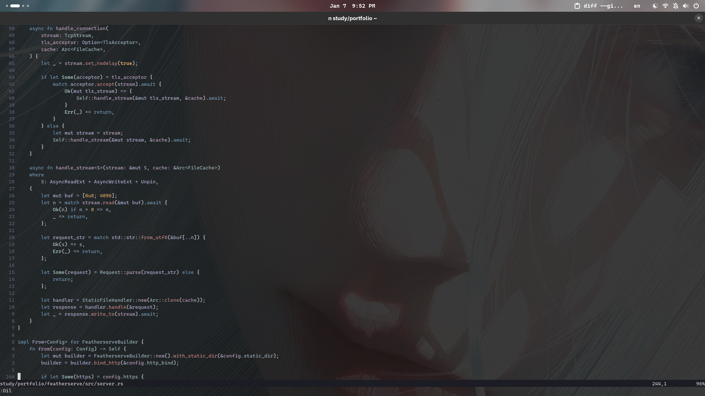

# Neovim Config

Minimal Neovim setup with LSP, autocompletion, and fuzzy finding.

## Plugins

- **mini.pick** - fuzzy finder
- **oil.nvim** - file explorer
- **nvim-cmp** - autocompletion
- **nvim-lspconfig** + **mason** - LSP support

## Keymaps

| Key | Action |
|-----|--------|
| `<leader>f` | Find files |
| `<leader>fh` | Find help |
| `<leader>e` | Open file explorer |
| `<leader>w` | Save |
| `<leader>q` | Quit |
